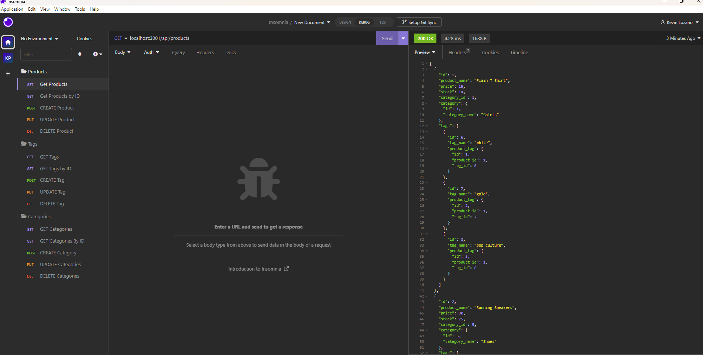

# Lozano E-commerce Back End App

## Description
This project works from the back-end database for an e-commerce application.  For this project, I used Express.js APIs and Sequelize to work with a mysql database.  This project uses API routes to get the information from the database, along with creating, updating, and deleting items in the database.  

## Links
- [github repo](https://github.com/klozano17/Lozano-E-commerce)
- [Video Demo on mysql and running server](https://drive.google.com/file/d/1NQHFJmQ-HZhJ2IBkXpimBpbVZv2MKEnj/view)
- [Insomnia Video Demo](https://drive.google.com/file/d/1IavMh6HVaCush2z1D4IZ5dIHaYP0EThh/view)

## Table of Contents
- [Installation](#installation)  
- [Usage](#usage)  
- [License](#license)  
- [Constributing](#contributing)  
- [Tests](#tests)  
- [Questions](#questions)

## Installation
Clone the repo into your vs code.  This application also requires node.js, express.js, mysql2, and sequelize.  To install these items, run `npm install` in the command line.  To start the application, you will first need to connect the schema to mysql.  To do so, first change your password in the .env file and then run `mysql -u root -p` in the command line, then type `SOURCE db/schema.sql`.  You will next need to seed the file by typing `npm run seed` into the command line. To start the server, type `npm start`.  The port used in this app is 3001. 

## Usage
Here is a screenshot that shows how the app runs in Insomnia

## License
This repository is not covered under any license.

## Contributing
To contribute to this application, just fork the repository!

## Tests
This application does not use any tests.

## Questions
Please reach out via my Github profile if you have any questions!

[GitHub profile](https://www.github.com/klozano17)    
  

